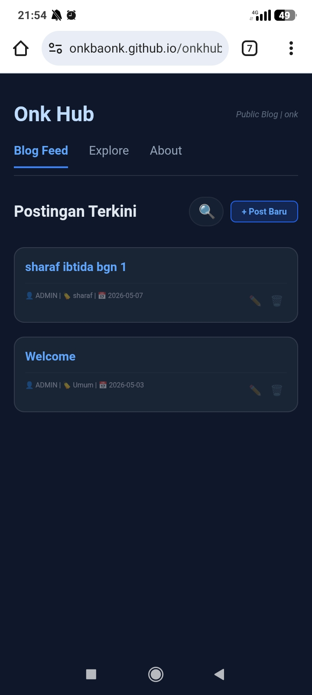
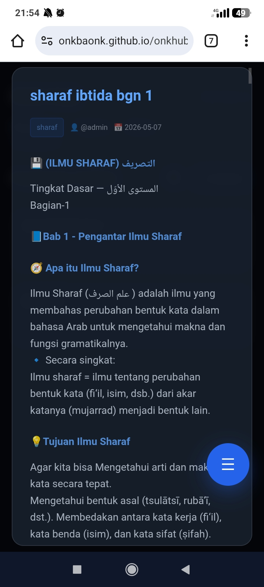
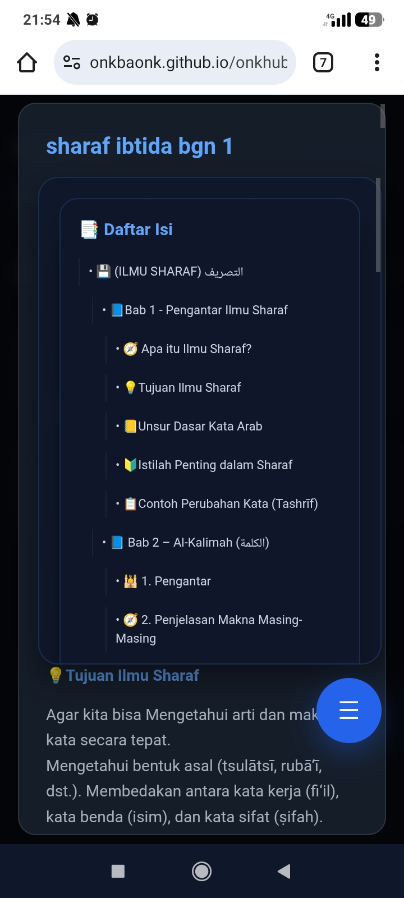
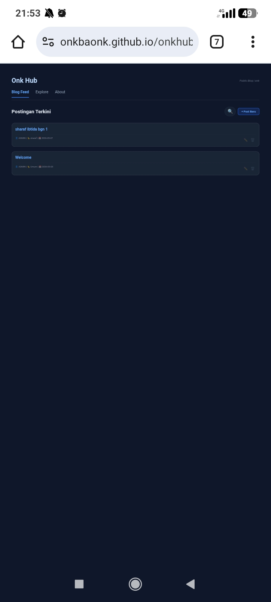
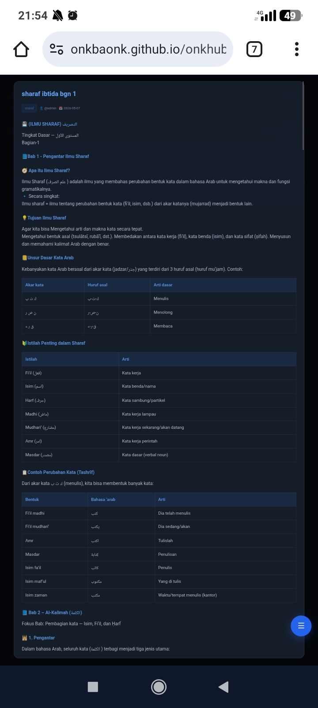
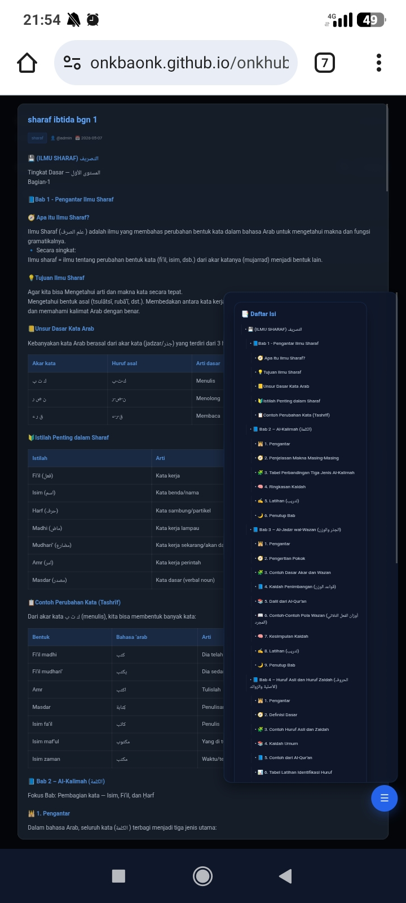

# Onk Hub

Static Git-Powered Blog CMS built with GitHub API, Markdown rendering, token-based publishing, and zero backend cost.

---

## Overview

Onkbaonk Hub adalah platform blogging minimalis berbasis static architecture.

Project ini dibuat untuk:

- membaca artikel secara publik tanpa login
- create/edit/delete post hanya menggunakan GitHub Token
- menggunakan GitHub repository sebagai storage database gratis
- tanpa backend tradisional
- ringan, fleksibel, dan cocok untuk project hobby/personal

---

## Features

### Public Access
- Semua visitor dapat membaca artikel tanpa login
- Blog list tampil publik
- Full post modal popup reader

### Author Access
- Create post
- Edit post
- Delete post
- Token-based access (tanpa register/login)

### Storage Architecture
- GitHub repository sebagai database
- JSON-based content
- Sharding per post

### Content Rendering
- Markdown support via Marked.js
- HTML fallback support
- Responsive table
- Heading, list, blockquote, code block

### UI
- Responsive modal popup
- Mobile optimized
- Category filter
- Search post
- About page

### SEO
- Slug article URL
- Canonical URL
- Meta description
- Search engine friendly

---

# Tech Stack

- HTML
- TailwindCSS
- Vanilla JavaScript
- GitHub API
- Marked.js

---

# Project Structure

```bash
project/
│
├── README.md
│
├── assets
│   ├── css
│   │   └── style.css
│   │
│   └── js
│       ├── api.js
│       ├── auth.js
│       ├── blog.js
│       └── main.js
│
├── blog_index.json
│
├── components
│   ├── about-me.html
│   ├── header.html
│   ├── modals.html
│   ├── navigation.html
│   ├── section-about.html
│   ├── section-blog.html
│   └── section-categories.html
│
├── index.html
├──  robots.txt
├── sitemap.xml
│
├── posts
│   ├── post_1777648331660.json
│   ├── post_1777648388895.json
│
└── users.json

5 directories, 20 files
```

---

# Architecture

## Blog Index

File ringan untuk list artikel:

```json
[
  {
    "id": 1711111111,
    "title": "Belajar Nahwu",
    "author": "admin",
    "category": "Tutorial",
    "date": "2026-05-03"
  }
]
```

Digunakan untuk:
- homepage
- category
- search

---

## Post Sharding

Setiap artikel disimpan terpisah:

```bash
posts/post_1711111111.json
```

Isi:

```json
{
  "id": 1711111111,
  "title": "Belajar Nahwu",
  "content": "# Judul\nIsi artikel...",
  "category": "Tutorial",
  "author": "admin",
  "date": "2026-05-03"
}
```

Keuntungan:
- ringan
- scalable
- tidak load semua post sekaligus

---

# Authentication System

Tidak menggunakan login/register.

Menggunakan GitHub Personal Access Token.

Flow:

1. User biasa baca publik
2. Owner klik create/edit/delete
3. Sistem meminta token
4. Token disimpan di localStorage

```js
localStorage.setItem("github_token", token)
```

---

# Security

## Aman untuk public repo?

Ya, selama:

- token tidak hardcoded
- token tidak di-commit ke repository

Contoh salah:

```js
const GITHUB_TOKEN = "ghp_xxx"
```

JANGAN.

Contoh benar:

```js
let GITHUB_TOKEN = localStorage.getItem("github_token") || "";
```

---

## Recommended GitHub Token Permission

Gunakan permission minimum:

- Contents: Read and Write

Tidak perlu:
- Admin
- Workflow
- Secrets
- Packages

---

## New Updates

### SEO Optimization
- Dynamic canonical URL
- Dynamic page title
- Dynamic meta description
- Slug URL support

Contoh URL artikel:

https://onkbaonk.github.io/onkhub/?post=sharaf-ibtida-bgn-1

Benefit:
- artikel bisa dibagikan langsung
- Google lebih mudah indexing halaman individual
- URL lebih clean dan SEO friendly

---

### Table of Contents (TOC)
- Auto generate daftar isi dari heading markdown (`#`, `##`, `###`)
- Floating TOC button
- Toggle show/hide TOC
- Responsive desktop & mobile
- Draggable floating button

Contoh markdown:

```md
# Pembuka
## Bab 1
### Sub Bab
```

Otomatis menghasilkan daftar isi navigasi.

---

### Responsive Content Rendering
- Responsive table wrapper
- Mobile horizontal table scroll
- Markdown rendering via Marked.js
- HTML fallback rendering

Supported:
- heading
- list
- blockquote
- code block
- table

---

### Modal Full Article Reader
- Full article popup modal
- No page reload
- Smooth reading experience
- URL tetap bisa dibagikan via slug

---

### Performance Optimization
- Blog index sharding
- Individual post sharding

Structure:

```bash
blog_index.json
posts/post_1711111111.json
```

Benefit:
- faster load
- scalable
- ringan walau artikel banyak


# Setup From Zero

---

## 1. Clone Repository

```bash
git clone https://github.com/onkbaonk/onkhub.git
cd repo
```
## Sebelum Menjalankan Aplikasi
 Update package & Install Python/Git:
   ```bash
   pkg update && pkg upgrade
   pkg install python git
   ```
Terus Buka Polder .git Cari File Config, Ganti Repository Oonk Dengan Repository Anda,
Dan Polder assets/api.js Masukan USERNAME_GITHUB_ANDA/NAMA_REPO_ANDA
Terus Git Push Dulu, Setelah Selesai Push

## Publish Repo

Repo boleh public.

Karena:
- read public
- write token only


## 2. Jalankan Local Server

Python:

```bash
python -m http.server 8080
```

Buka:

```bash
http://localhost:8080
```

---

## 3. Buat GitHub Token

GitHub:

Settings  
→ Developer Settings  
→ Personal Access Tokens

Permission:

- Contents: Read and Write

Copy token.

---

## 4. Set Token

Saat create/edit/delete:

system prompt:

```txt
Masukkan GitHub Token
```

Token disimpan otomatis.

 
# Markdown Support

Menulis artikel:

```md
# Judul

Isi artikel.

## Table

| Nama | Arti |
|---|---|
| Isim | Kata benda |
| Fi'il | Kata kerja |

> Quote
```

---

## HTML Fallback

Bisa pakai HTML:

```html
<table>
<tr>
<th>Nama</th>
<th>Arti</th>
</tr>
<tr>
<td>Isim</td>
<td>Kata benda</td>
</tr>
</table>
```

---

# Responsive Table

Table otomatis scroll horizontal di mobile.

Hanya table yang scroll, bukan seluruh artikel.

---

# Available Tabs

- Blog
- Categories
- About

---

# About Project

Onkbaonk Hub is a lightweight static CMS powered by GitHub API.

Built for:
- hobby blogging
- notes
- documentation
- lightweight publishing

---

# Future Roadmap

- Syntax highlight
- Analytics
- Image upload external CDN
- Pagination
- Sitemap.xml generator
- RSS feed
- Open Graph preview

---

# Why This Project?

Traditional stack:

- Hosting
- Database
- Backend
- Maintenance cost

This project avoids all of that.

Benefits:

- $0 hosting cost
- zero backend
- public content
- secure owner publishing

---

# Philosophy

> Built on static architecture.  
> Powered by Git.  
> Secured by token access.

---

# License

MIT License

---

### 📸 Screenshot Aplikasi
<p align="center">


</p>
<p align="center">


</p>
<p align="center">


</p>

# Author

Onk Hub  
Built for learning, experimentation, and minimalist publishing.
